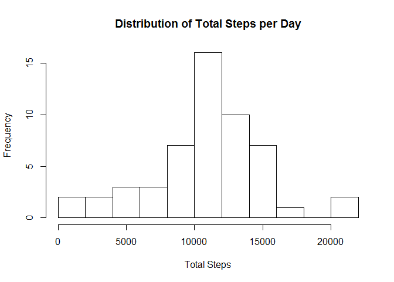
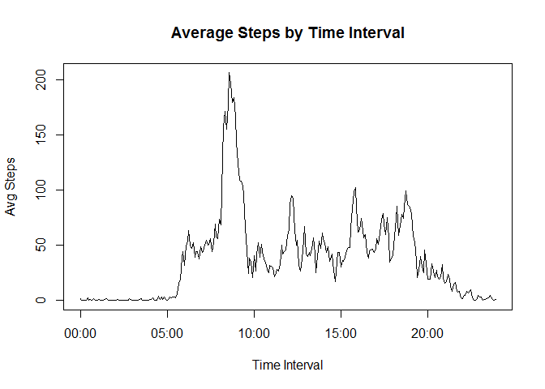
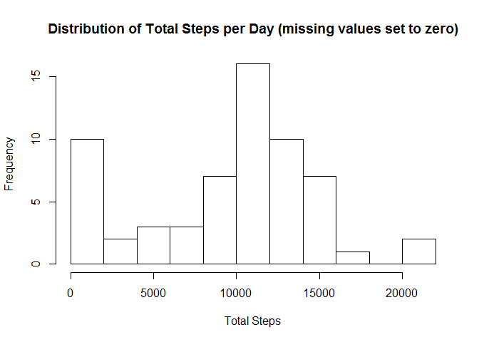
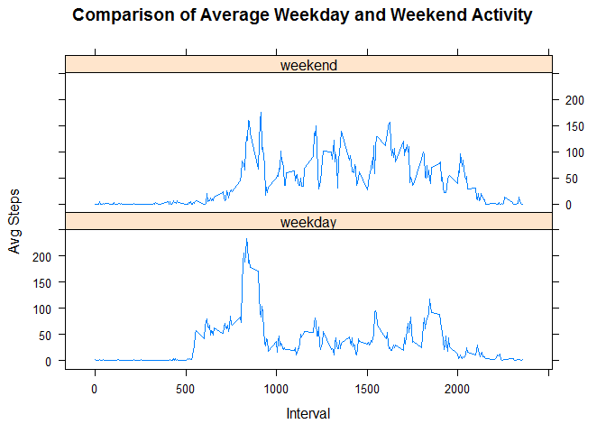

# Reproducible Research: Peer Assessment 1


This assignment uses data from a personal activity monitoring device that collects the number of steps taken in 5 minute intervals.


## Loading and preprocessing the data

Read data from the file and select rows without missing data.


```r
alldata=read.csv("activity.csv",header=TRUE,colClasses=c("integer","character","integer"),stringsAsFactors=FALSE)
data=alldata[!is.na(alldata$steps),]
```


## What is mean total number of steps taken per day?

Calculate the total number of steps for each day, and create a histogram. Also print the mean and median total daily steps.


```r
totalstepsperday=aggregate(data$steps,by=list(date=data$date),FUN=sum)
hist(totalstepsperday$x,10,xlab="Total Steps",main="Distribution of Total Steps per Day")
```



```r
meantotalsteps=mean(totalstepsperday$x)
mediantotalsteps=median(totalstepsperday$x)
print(paste("Mean total daily steps:",meantotalsteps))
```

```
## [1] "Mean total daily steps: 10766.1886792453"
```

```r
print(paste("Median total daily steps:",mediantotalsteps))
```

```
## [1] "Median total daily steps: 10765"
```

The mean is 1.0766189\times 10^{4}, and the median is 10765.


## What is the average daily activity pattern?

Calculate the average daily steps in each time interval. Find the interval with the highest average number of steps.


```r
avgstepsbyinterval=aggregate(data$steps,by=list(interval=data$interval),FUN=mean)
names(avgstepsbyinterval)=c("interval","avgsteps")
plot(as.POSIXct(sprintf("%04i",avgstepsbyinterval$interval),format="%H%M"),avgstepsbyinterval$avgsteps,type="l",xlab="Time Interval",ylab="Avg Steps",main="Average Steps by Time Interval")
```



```r
maxinterval=avgstepsbyinterval$interval[avgstepsbyinterval$avgsteps==max(avgstepsbyinterval$avgsteps)]
print(paste("Interval with maximum average steps:",maxinterval))
```

```
## [1] "Interval with maximum average steps: 835"
```

The interval with the maximum average steps is 835.


## Imputing missing values

Find the number of missing values.


```r
numna=length(alldata[is.na(alldata$steps),1])
print(paste("Number of NA entries:",numna))
```

```
## [1] "Number of NA entries: 2304"
```

The number of missing entries is 2304.

Let's assume that a missing value represents zero steps during that interval. This is not a sophisticated method of filling in the missing data, but it may be better than others because we cannot necessarily assume there is activity.

Create a histogram of total daily steps like previously, but this time include the filled data, with missing values set to zero. Print mean and median of the filled data.


```r
datafillmissing=alldata
datafillmissing$steps[is.na(datafillmissing$steps)]=0
totalstepsperdayfillmissing=aggregate(datafillmissing$steps,by=list(date=datafillmissing$date),FUN=sum)
hist(totalstepsperdayfillmissing$x,10,xlab="Total Steps",main="Distribution of Total Steps per Day (missing values set to zero)")
```



```r
meantotalstepsfill=mean(totalstepsperdayfillmissing$x)
mediantotalstepsfill=median(totalstepsperdayfillmissing$x)
print(paste("Mean total daily steps (missing values set to zero):",meantotalstepsfill))
```

```
## [1] "Mean total daily steps (missing values set to zero): 9354.22950819672"
```

```r
print(paste("Median total daily steps (missing values set to zero):",mediantotalstepsfill))
```

```
## [1] "Median total daily steps (missing values set to zero): 10395"
```

The mean is 9354.2295082, and the median is 1.0395\times 10^{4}. These are lower than for the data without missing values, which makes sense because of the method of filling (setting to zero).


## Are there differences in activity patterns between weekdays and weekends?
Now do a comparison of weekday and weekend activity using the average daily steps in each time interval.

```r
daytype=as.character(weekdays(as.Date(data$date,"%Y-%m-%d"))=="Sunday" | weekdays(as.Date(data$date,"%Y-%m-%d"))=="Saturday")
daytype[daytype=="FALSE"]="weekday"
daytype[daytype=="TRUE"]="weekend"
data$daytype=as.factor(daytype)
avgsteps=aggregate(data$steps,by=list(interval=data$interval,daytype=data$daytype),FUN=mean)
names(avgsteps)=c("interval","daytype","avgsteps")
library(lattice)
p=xyplot(avgsteps~interval|daytype,avgsteps,type="l",layout=c(1,2),xlab="Interval",ylab="Avg Steps",main="Comparison of Average Weekday and Weekend Activity")
print(p)
```



It appears that the average weekend has more consistent activity throughout the day whereas weekdays have a sharp peak in the morning and several smaller peaks throughout the rest of the day. Additionally, the weekday activity is shifted to the left compared to weekend, which would correspond to waking up and going to bed earlier on weekdays and the opposite on weekends.


